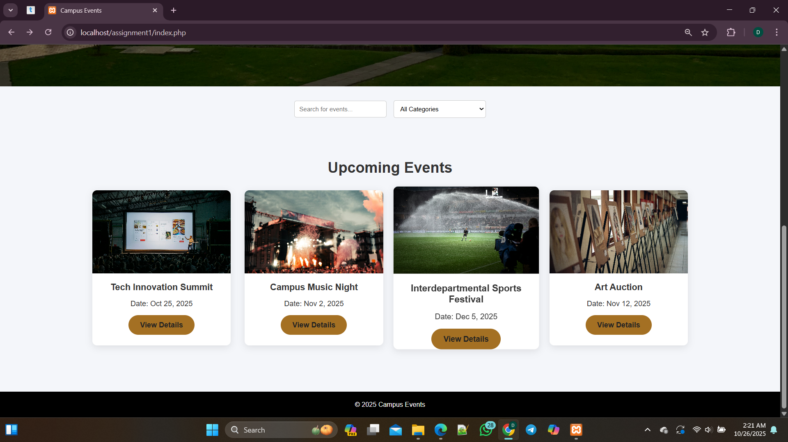

## Event-management
🔗 A project to manage participants for campus event 
  
This Event Registration System is to help manage participants for campus events.  
It allows students to register for events, view participant lists, and automatically limit registrations when an event reaches full capacity.  
The project also includes a search/filter function and a simulated confirmation email (no actual emails sent).

## Overview of the project
>This project consists of the following pages
>- A landing page
>- A login and Registration Page
>- Event Page
>- Event Details 

🔗 This project is an Event Management System designed to help organize and manage school or campus events. 
It allows users to register for events, and lets the admin create, edit, and delete events. 
The system also helps keep track of participants and makes sure that no event goes beyond its capacity. 
The project was developed using PHP, MySQL, HTML, CSS, JavaScript, and Bootstrap. 
It was a group project aimed at learning how to build a functional web application that handles real-world event registration and management tasks.

## Project setup 

🔗 Prerequisites

Before you begin, you need to install XAMPP on your computer.

Download XAMPP here → XAMPP Download for Windows, Mac OS, and Ubuntu

Follow the setup steps for your system:

For Windows

For Mac OS

For Ubuntu

If you prefer, you can use other local servers such as:

WAMP (Windows)

LAMP (Ubuntu/Linux)

MAMP (Mac OS)

AMPPS, WPN-XM, or EasyPHP

🔗 Running the Project on Your Local Machine

Clone the project to your computer using the GitHub link:
https://github.com/group-6eventmanagement/event-management.git

Copy the project folder into the htdocs folder inside your XAMPP directory.

Open XAMPP Control Panel, and make sure both Apache and MySQL are running.

Open your browser and type the following in the address bar:
http://localhost/event-management/public/

🔗 Working with phpMyAdmin

Open your browser and visit:
http://localhost/phpmyadmin/

Create a new database (you can name it event_management).

Import the SQL file provided in the sql/ folder.

Once the import is done, the database tables will appear automatically.

If needed, you can view or edit data directly from phpMyAdmin (for example, add an admin or user record).

🔗 Features

User registration and login

Admin dashboard to manage events

Create, update, or delete events

Event capacity management (prevents overbooking)

Search and filter functionality

User-friendly and responsive interface. 

## Group members, matric number and contribution

ONYEACHO ANTHONY | 23/1541| DATABASE DESIGN AND PROJECT MANAGER
RAPHAEL EJIRE-ABEE | 23/2069 | BACKEND DEVELOPER(FORM HANDLING-POST AND DATA DISPLAY-GET) AND DATABASE DESIGN
ONABAMIRO MOYOSORE FAITH | 23/0550 | FRONTEND DEVELOPER
OSAWUTA NDUKA CHRIS | 23/1473 | SEARCH FILTER AND EMAIL STIMULATION
MBAONU JEZREEL ABIODUN | 23/O383 | EMAIL STIMULATION ENGINEER AND TESTING
OKORARE OLUWAPELUMI DEBORAH | 23/1657 | DATABASE DESIGN | DOCUMENTATION, README, AND GIT REPOSITORY
OGUNSINA MOYINOLUWA SAMANTHA | 23/0842 | UI, SCREENSHOTS AND PRESENTATION

# OGUNSINA NOYINOLUMA SAMANTHA | 23/0842  
## UI Screenshots  

---

## 🏠 Home Page

## 🎫 View Events Page

## 🧾 Event Details Page

## 💾 Database Connection Page

## 📝 Register Page

## 🧍 Participant Registration

## ✅ Registration Successful

## 🔐 Login Page

## 👋 Welcome User

## ✉ Contact Page

## 📤 Messages Sent to Database

## 📦 Messages Database Page

## 👥 Users Database Page

